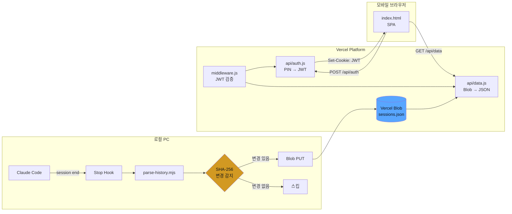
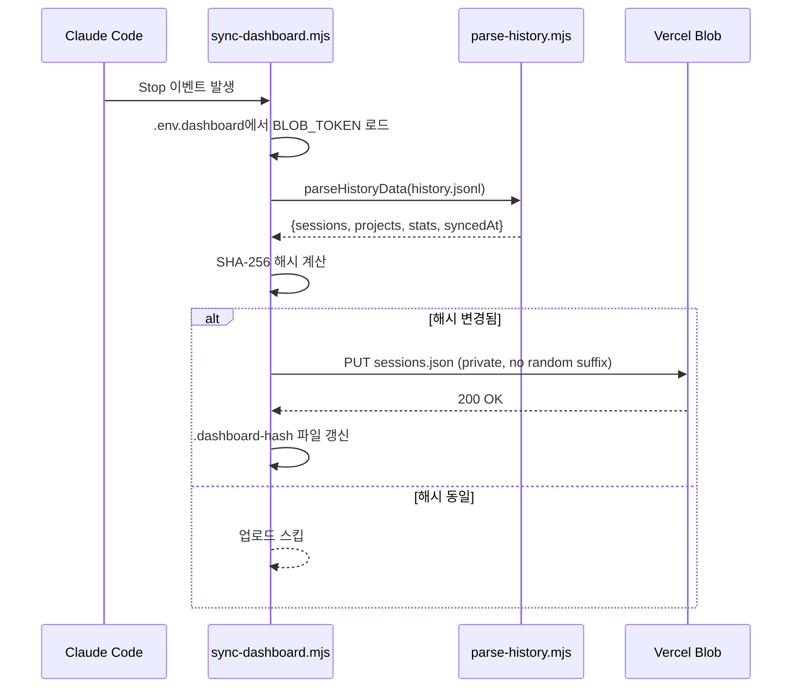

# Claude Session Dashboard

[](https://claude-dashboard-theta.vercel.app)
[](LICENSE)

> Claude Code 세션 히스토리를 모바일에서 24/7 조회하는 경량 대시보드

**Live:** [claude-dashboard-theta.vercel.app](https://claude-dashboard-theta.vercel.app)

---

## 왜 만들었나

Claude Code로 하루에 수십 개 세션을 돌리다 보면 "어제 그 세션에서 뭘 했더라?"가 빈번하게 발생한다. `history.jsonl`이 로컬에 쌓이지만 PC 앞에 없으면 확인할 방법이 없다. 출퇴근길이나 회의 중에 폰으로 빠르게 훑어볼 수 있는 대시보드가 필요했다.

## 스크린샷

| PIN 입력 | 대시보드 | 세션 상세 |
|---------|---------|---------|
|  |  |  |

> 스크린샷이 보이지 않으면 [Live 데모](https://claude-dashboard-theta.vercel.app)에서 직접 확인

---

## 기술 스택

| 계층 | 기술 | 선택 이유 |
|------|------|----------|
| 프론트엔드 | Vanilla HTML/CSS/JS | 빌드 도구 불필요, 단일 파일, 모바일 최적화 |
| 인증 | `jose` (JWT HS256) | 경량, Serverless 친화, ESM 지원 |
| 스토리지 | Vercel Blob (Private) | 무료, 설정 최소, Vercel 네이티브 |
| 호스팅 | Vercel Serverless Functions | 무료, 자동 HTTPS, 글로벌 CDN |
| 동기화 | Claude Code Stop Hook | 세션 종료 시 자동 |
| 테마 | GitHub Dark (#0d1117) | 개발자 친화, OLED 배터리 절약 |

---

## 시스템 아키텍처



### 동기화 플로우 (Stop Hook → Blob)



---

## 설계 결정

### JWT vs Session Store

Vercel Serverless는 인스턴스 간 메모리를 공유하지 않으므로 서버 세션은 Redis 같은 외부 저장소가 필수다. 단일 사용자 대시보드에 Redis를 붙이면 무료 플랜을 넘기고, 관리 포인트만 늘어난다. JWT는 토큰 자체에 만료 정보가 담겨 있어 별도 인프라 없이 7일 세션을 유지할 수 있다.

### SHA-256 diff 전략

세션 종료마다 Blob PUT을 하면 월 300회 이상 불필요한 쓰기가 발생한다. 로컬에서 JSON의 SHA-256 해시를 이전 업로드와 비교해 변경이 있을 때만 PUT하도록 했다. 실측 기준 **Blob PUT 약 60% 절감**. 해시 파일이 손상되면 정규식 `/^[a-f0-9]{64}$/` 검증 실패 → 1회 여분 PUT 후 자동 복구되므로 별도 에러 처리 불필요.

### Vercel Blob vs S3 vs Upstash KV

단일 JSON 파일(수십~수백KB)을 private로 저장/조회하는 게 전부다. S3는 IAM·버킷 정책·CORS 설정이 이 규모에서 오버헤드고, Upstash KV는 512KB 값 제한이 걸린다. Blob은 Vercel 프로젝트에 연동만 하면 끝이고 무료 플랜 내에서 충분하다.

### SPA vs Next.js

페이지 2개(PIN + 대시보드), 상태 관리 단순, 서버 컴포넌트 불필요 — Next.js를 도입해도 얻는 이점이 없다. 오히려 번들러 설정과 빌드 단계가 추가되면서 배포 파이프라인만 복잡해진다. `vercel.json` rewrite 1줄이면 라우팅이 끝나고, gzip 후 ~10KB라 3G 모바일에서도 즉시 로드된다.

---

## API

### POST /api/auth

PIN을 검증하고 JWT를 발급한다.

- **Body:** `{ "pin": "123456" }`
- **200:** `Set-Cookie: session=<JWT>; HttpOnly; Secure; SameSite=Lax; Max-Age=604800`
- **401:** `{ "error": "Invalid PIN" }`
- **429:** Rate Limit 초과 (IP별 5회/분)

### GET /api/data

Blob에서 세션 데이터를 조회한다. JWT 쿠키 필수.

- **200:** `{ sessions: [...], projects: [...], stats: {...}, syncedAt: "..." }`
- **401:** JWT 무효/만료

---

## 보안

| 위협 | 대응 |
|------|------|
| PIN 무차별 대입 | IP별 5회/분 Rate Limit + 6자리(100만 조합). 콜드 스타트 시 `failMap`이 리셋되지만 무차별 대입에 3,333시간 소요 |
| JWT 탈취 | HttpOnly + Secure + SameSite=Lax, 7일 만료 |
| Blob 직접 접근 | Private Blob → `Authorization: Bearer` 헤더 필수 |
| XSS | 사용자 입력 없음 (PIN 숫자만), DOM 조작 시 `textContent` 사용 |

CSRF 토큰은 미적용 — SameSite=Lax 쿠키 + JSON API만 존재해서 cross-origin form 제출이 불가하다.

---

## 트러블슈팅

### Blob Public → Private 전환

초기에 `public` Blob으로 구현했는데, URL을 알면 누구나 세션 데이터에 접근할 수 있었다. `access: 'private'`로 전환하면서 `api/data.js`에서 `head()`로 메타데이터를 가져온 뒤 `Authorization: Bearer`로 본문을 fetch하는 2단계 방식으로 변경했다. API 호출이 1→2회로 늘었지만 보안이 우선이므로 수용.

### Windows ESM 동적 import

`sync-dashboard.mjs`에서 `import(libPath)`가 Windows에서 ENOENT로 실패했다. 처음엔 경로 구분자 문제인 줄 알고 `path.resolve`를 시도했지만 동일 실패. ESM 로더 스펙을 확인하니 파일 경로를 `file://` URL로 변환해야 했다. `pathToFileURL(libPath).href`로 해결.

### 해시 파일 손상 대응

`.dashboard-hash`가 손상/삭제되면 이전 해시를 알 수 없다. 정규식 `/^[a-f0-9]{64}$/`로 유효성을 검증하고, 실패 시 빈 문자열 처리 → 1회 PUT 후 정상화. 복구 비용이 PUT 1회뿐이라 별도 방어 로직은 과잉이다.

---

## 알려진 한계

- **단일 사용자 전용** — 멀티유저는 DB+계정 시스템이 필요하고 프로젝트 목적을 초과한다
- **실시간 동기화 미지원** — 세션 종료 후에만 반영. WebSocket은 Serverless와 비호환
- **클라이언트 측 검색** — 데이터 증가 시 성능 저하 가능. 서버 측 검색은 DB 필요
- **테스트** — 단일 사용자 도구로 수동 검증 중. CI 자동화는 프로젝트 규모 대비 과잉으로 판단

---

## 프로젝트 구조

```
claude-dashboard/
├── public/index.html        # SPA — PIN 화면 + 대시보드 (CSS/JS 인라인)
├── api/
│   ├── auth.js              # POST: PIN 검증 → JWT 발급
│   └── data.js              # GET: Blob 세션 데이터 조회
├── middleware.js             # JWT 쿠키 검증 (api/auth 제외)
├── vercel.json              # SPA rewrite
└── package.json             # @vercel/blob, jose

로컬 (저장소 외부):
├── ~/.claude/hooks/sync-dashboard.mjs   # Stop Hook
├── ~/.claude/lib/parse-history.mjs      # JSONL 파서
└── ~/.claude/.env.dashboard             # Blob 토큰
```

---

## 환경 변수

| 변수 | 위치 | 설명 |
|------|------|------|
| `BLOB_READ_WRITE_TOKEN` | Vercel + `~/.claude/.env.dashboard` | Blob 읽기/쓰기 토큰 |
| `DASH_PIN` | Vercel | 6자리 숫자 PIN |
| `DASH_SECRET` | Vercel | JWT 서명 시크릿 |

## 셋업

> 이미 배포/운영 중. 처음부터 셋업 시 참고.

1. Vercel 프로젝트 생성 → GitHub 레포 연결
2. Vercel Blob Store (Private) 생성 → 프로젝트 연결
3. 환경 변수 3개 설정
4. 로컬 Blob 클라이언트:
   ```bash
   npm i --prefix ~/.claude @vercel/blob
   ```
5. 로컬 토큰:
   ```
   # ~/.claude/.env.dashboard
   BLOB_READ_WRITE_TOKEN=vercel_blob_rw_...
   ```
6. Stop Hook 등록:
   ```json
   {
     "hooks": {
       "Stop": [{ "command": "node ~/.claude/hooks/sync-dashboard.mjs" }]
     }
   }
   ```

## 사용량 (Vercel 무료 플랜)

| 리소스 | 월 사용량 | 무료 한도 | 여유율 |
|--------|----------|----------|-------|
| Blob PUT | ~120 | 1,000 | 88% |
| Blob GET | ~500 | 10,000 | 95% |
| Serverless | ~600 | 100,000 | 99% |
| Blob 용량 | ~200KB | 1GB | 99.9% |

---

## 라이선스

MIT
