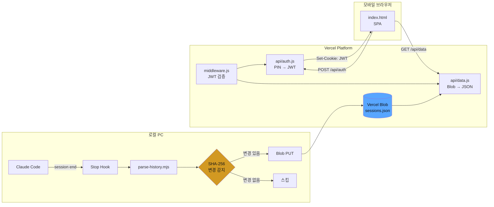
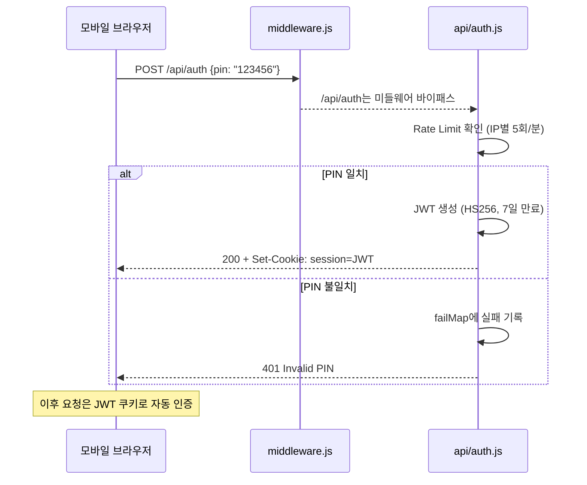
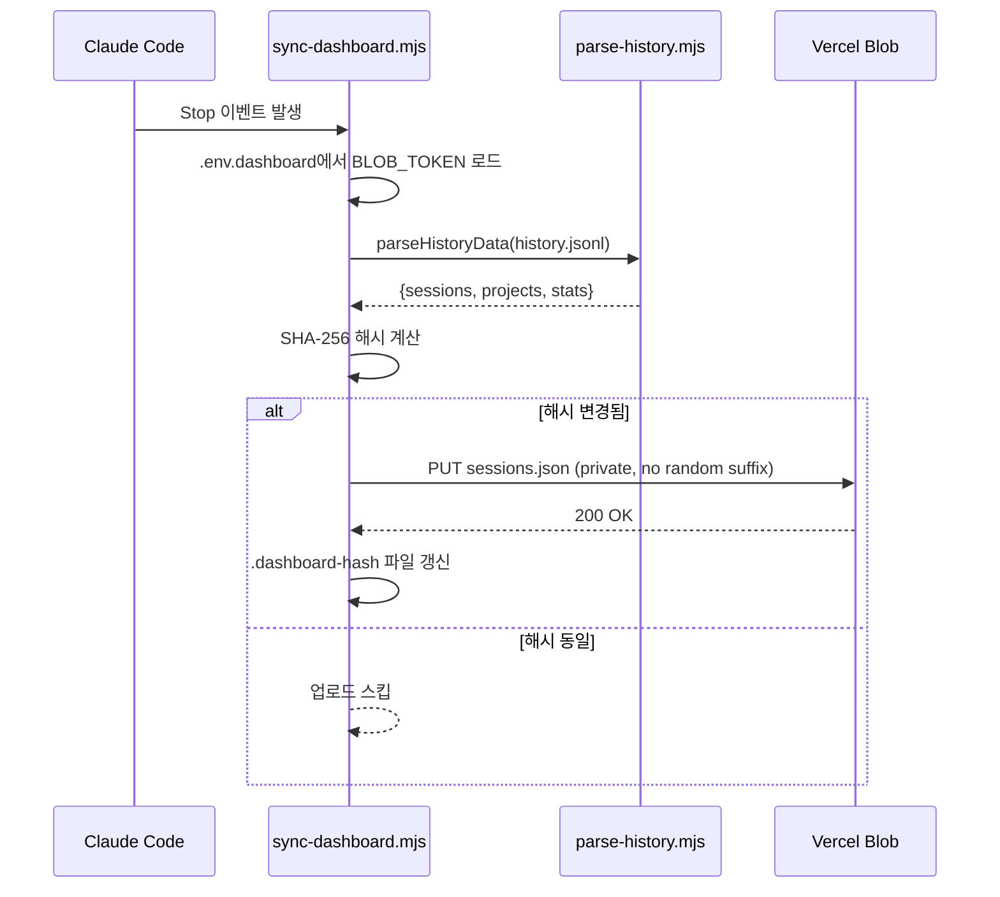
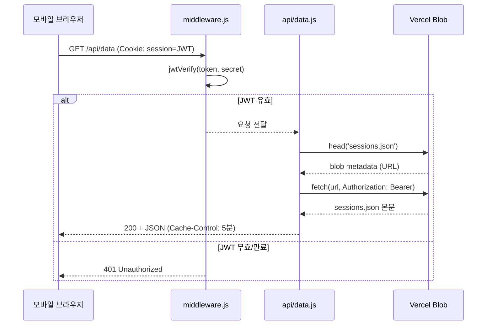

# Claude Session Dashboard

[](https://claude-dashboard-theta.vercel.app)
[](LICENSE)

> Claude Code 세션 히스토리를 모바일에서 24/7 조회하는 경량 대시보드

**Live:** [claude-dashboard-theta.vercel.app](https://claude-dashboard-theta.vercel.app)

---

## 왜 만들었나

Claude Code로 하루에 수십 개 세션을 돌리다 보면 "어제 그 세션에서 뭘 했더라?"가 빈번하게 발생한다. `history.jsonl`이 로컬에 쌓이지만 PC 앞에 없으면 확인할 방법이 없다. 출퇴근길이나 회의 중에 폰으로 빠르게 훑어볼 수 있는 대시보드가 필요했다.

**핵심 요구사항:**
- PC 없이 폰에서 세션 이력 열람
- 수동 조작 없이 세션 종료 시 자동 동기화
- Vercel 무료 플랜 내 운영 (월 $0)

---

## 시스템 아키텍처



---

## 주요 플로우

### 1. 인증 (PIN → JWT)



### 2. 세션 동기화 (Stop Hook → Blob)



### 3. 데이터 조회



---

## 설계 결정

### JWT vs Session Store

| 고려사항 | JWT (채택) | 서버 세션 |
|---------|-----------|----------|
| 서버리스 적합성 | 상태 없음, 함수 간 공유 불필요 | Redis 등 외부 저장소 필요 |
| 무료 플랜 운영 | 추가 인프라 없음 | Redis 비용 발생 |
| 만료 관리 | 토큰 자체에 포함 | 서버측 세션 정리 필요 |

> **채택 근거:** Vercel Serverless는 인스턴스 간 메모리를 공유하지 않으므로 서버 세션은 외부 저장소가 필수. 단일 사용자 대시보드에 Redis를 붙이는 건 과잉 설계.

### 메모리 기반 Rate Limit

Serverless 콜드 스타트 시 `failMap`이 리셋되지만, 6자리 PIN(100만 조합) + IP당 5회/분 제한 조합으로 무차별 대입에 **3,333시간** 소요. 외부 저장소 없이도 충분한 방어력.

### SHA-256 diff 전략

모든 세션 종료 시 Blob PUT을 하면 월 300회 이상 불필요한 쓰기 발생. 로컬 해시 비교로 **Blob PUT 약 60% 절감**. 해시 파일 손상 시 1회 여분 PUT만 발생하므로 허용.

### Vercel Blob vs S3 vs KV

| 기준 | Vercel Blob (채택) | S3 | Upstash KV |
|------|-------------------|----|-----------|
| 설정 복잡도 | 프로젝트 연동만 | IAM, 버킷 정책, CORS | 별도 계정 + 연동 |
| 비용 | 무료 플랜 내 | 가능하나 설정 복잡 | 무료 티어 제한적 |
| 파일 크기 | JSON 수십~수백KB 적합 | 오버스펙 | 512KB 값 제한 |

> 단일 JSON 파일 private 저장/조회에 Blob이 가장 적합. S3는 이 규모에서 IAM 오버헤드.

### SPA (빌드 도구 없음) vs Next.js

`index.html` 단일 파일로 전체 UI 구현:

- **배포 단순성** — `vercel.json` rewrite 1줄로 라우팅 완료
- **의존성 제로** — vanilla JS만으로 충분한 복잡도
- **번들 크기** — gzip ~10KB, 3G 모바일에서도 즉시 로드

---

## 보안 설계

| 위협 | 대응 |
|------|------|
| PIN 무차별 대입 | IP별 5회/분 Rate Limit + 6자리 = 3,333시간 |
| JWT 탈취 | HttpOnly + Secure + SameSite=Lax, 7일 만료 |
| Blob 직접 접근 | Private Blob → Authorization 헤더 필수 |
| XSS | 사용자 입력 없음 (PIN 숫자만), `textContent` 사용 |

**의도적 미적용:**
- CSRF 토큰 — SameSite=Lax + JSON API라 cross-origin form 제출 불가
- Rate Limit 영속화 — PIN 엔트로피가 충분

---

## 트러블슈팅

### Blob Public → Private 전환

**문제:** 초기 `public` Blob은 URL만 알면 누구나 세션 데이터 접근 가능.
**해결:** `access: 'private'` 전환 + `head()` → `Authorization: Bearer` fetch 2단계 방식.
**트레이드오프:** API 호출 1→2회 증가. 보안 우선이므로 수용.

### Windows ESM 동적 import

**문제:** `import(libPath)`가 Windows에서 실패. ESM 로더가 `file://` URL 필요.
**해결:** `pathToFileURL(libPath).href`로 변환 후 동적 import.

### 해시 파일 손상 대응

**문제:** `.dashboard-hash` 손상/삭제 시 이전 해시 알 수 없음.
**해결:** 정규식 `/^[a-f0-9]{64}$/` 검증, 실패 시 빈 문자열 → 1회 PUT 후 정상화.

---

## 알려진 한계

| 한계 | 미적용 사유 |
|------|-----------|
| 단일 사용자 전용 | 멀티유저 시 DB+계정 필요 → 프로젝트 목적 초과 |
| Rate Limit 콜드 스타트 리셋 | Redis는 무료 플랜 초과 |
| 메시지 미리보기 8개 제한 | 전체 저장 시 Blob 용량 급증 |
| 실시간 동기화 미지원 | WebSocket은 Serverless와 비호환 |
| 클라이언트 측 검색만 | 서버 측 검색은 DB 필요 |

---

## 다음 개선 사항

- [ ] 세션 내 메시지 전문 검색
- [ ] 프로젝트별 상세 통계 (일별 추이, 평균 세션 길이)
- [ ] 오래된 세션 자동 아카이빙
- [ ] PWA manifest (홈 화면 설치)
- [ ] 세션 북마크/태깅

---

## 기술 스택

| 계층 | 기술 | 선택 이유 |
|------|------|----------|
| 프론트엔드 | Vanilla HTML/CSS/JS | 빌드 도구 불필요, 단일 파일, 모바일 최적화 |
| 인증 | `jose` (JWT HS256) | 경량, Serverless 친화, ESM 지원 |
| 스토리지 | Vercel Blob (Private) | 무료, 설정 최소, Vercel 네이티브 |
| 호스팅 | Vercel Serverless Functions | 무료, 자동 HTTPS, 글로벌 CDN |
| 동기화 | Claude Code Stop Hook | 세션 종료 시 자동 |
| 테마 | GitHub Dark (#0d1117) | 개발자 친화, OLED 배터리 절약 |

---

## 프로젝트 구조

```
claude-dashboard/
├── public/index.html        # SPA — PIN 화면 + 대시보드 (CSS/JS 인라인)
├── api/
│   ├── auth.js              # POST: PIN 검증 → JWT 발급
│   └── data.js              # GET: Blob 세션 데이터 조회
├── middleware.js             # JWT 쿠키 검증 (api/auth 제외)
├── vercel.json              # SPA rewrite
└── package.json             # @vercel/blob, jose

로컬 (저장소 외부):
├── ~/.claude/hooks/sync-dashboard.mjs   # Stop Hook
├── ~/.claude/lib/parse-history.mjs      # JSONL 파서
└── ~/.claude/.env.dashboard             # Blob 토큰
```

---

## 환경 변수

| 변수 | 위치 | 설명 |
|------|------|------|
| `BLOB_READ_WRITE_TOKEN` | Vercel + `~/.claude/.env.dashboard` | Blob 읽기/쓰기 토큰 |
| `DASH_PIN` | Vercel | 6자리 숫자 PIN |
| `DASH_SECRET` | Vercel | JWT 서명 시크릿 |

---

## 셋업

> 이미 배포/운영 중. 처음부터 셋업 시 참고.

1. Vercel 프로젝트 생성 → GitHub 레포 연결
2. Vercel Blob Store (Private) 생성 → 프로젝트 연결
3. 환경 변수 3개 설정
4. 로컬 Blob 클라이언트:
   ```bash
   npm i --prefix ~/.claude @vercel/blob
   ```
5. 로컬 토큰:
   ```
   # ~/.claude/.env.dashboard
   BLOB_READ_WRITE_TOKEN=vercel_blob_rw_...
   ```
6. Stop Hook 등록:
   ```json
   {
     "hooks": {
       "Stop": [{ "command": "node ~/.claude/hooks/sync-dashboard.mjs" }]
     }
   }
   ```

---

## 사용량 (Vercel 무료 플랜)

| 리소스 | 월 사용량 | 무료 한도 | 여유율 |
|--------|----------|----------|-------|
| Blob PUT | ~120 | 1,000 | 88% |
| Blob GET | ~500 | 10,000 | 95% |
| Serverless | ~600 | 100,000 | 99% |
| Blob 용량 | ~200KB | 1GB | 99.9% |

---

## 라이선스

MIT
